# Thiết kế hệ thống & CSDL — Website Đông Sơn Holdings (DSH)

> Phân tích dữ liệu cho CMS quản trị nội dung website DSH.
> **Nguồn phân tích:** `index.html` (bản dựng hoàn chỉnh, 9 section + header/footer), `.claude/SECTIONS.md`, `.claude/CLAUDE.md`, `.claude/rules/naming-conventions.md`, `.claude/rules/database.md`, `.claude/rules/security.md`.
> **Figma:** không truy cập được qua MCP (node `1134:25` là node *section*, MCP trả sparse — đúng như ghi chú trong `CLAUDE.md`). Toàn bộ phân tích suy ra từ markup thật.
> **Ngày:** 2026-07-24 · **Nền tảng triển khai:** Yii Framework 1.1.30 + PHP 8.x + MySQL 8

---

## 0. Nguyên tắc chung

- Bảng: `snake_case` số nhiều. Cột: `snake_case`.
- Mỗi bảng nội dung có: `id` (PK), `created_at`, `updated_at`, `deleted_at` (soft delete).
- Boolean: tiền tố `is_` / `has_`.
- Sắp xếp thủ công: `sort_order INT NOT NULL DEFAULT 0` (CMS kéo-thả).
- Trạng thái xuất bản: `status` (`draft`/`published`/`archived`) + `published_at`.
- Index: `idx_<table>_<cols>`, unique: `uniq_<table>_<cols>`, FK: `fk_<child>_<parent>`.
- **Ảnh không lưu path chuỗi rời rạc** → lưu `media_id` FK về `media_files` (một nguồn sự thật, thay ảnh 1 chỗ đổi mọi nơi). Giữ đúng ràng buộc "mọi asset là local" của `CLAUDE.md`.

---

## 1. Bảng tổng hợp — 38 bảng

### (a) Nội dung theo section — 16 bảng

| # | Bảng | Mục đích | Section |
|---|------|----------|---------|
| 1 | `hero_slides` | 4 slide hero (logo, tiêu đề, phụ đề, 2 CTA, ảnh nền) | S1 Hero |
| 2 | `business_sectors` | Lĩnh vực kinh doanh 01–04 — **dùng chung S2 và S4** | S2 + S4 |
| 3 | `business_sector_tags` | Tag/chip của mỗi lĩnh vực (BOT, Cao tốc, EPC…) | S2 + S4 |
| 4 | `about_blocks` | Card Sứ mệnh / Tầm nhìn | S3 |
| 5 | `projects` | Dự án tiêu biểu | S5 |
| 6 | `project_images` | Gallery ảnh trang chi tiết dự án | S5 |
| 7 | `core_values` | 4 giá trị cốt lõi | S6 |
| 8 | `timeline_milestones` | Mốc 2009…2026 | S7 |
| 9 | `partners` | Logo đối tác / cổ đông chiến lược | S8 |
| 10 | `news_categories` | Danh mục tin — nguồn của tab lọc | S9 |
| 11 | `news_posts` | Bài tin tức | S9 |
| 12 | `tags` | Tag tự do | S9 |
| 13 | `news_post_tags` | N-N bài viết ↔ tag | S9 |
| 14 | `quotes` | Quote lớn S3 và quote nhỏ S7 | S3, S7 |
| 15 | `cta_banners` | Banner CTA footer | Footer |
| 16 | `section_settings` | Tiêu đề/intro/link/ảnh nền + bật tắt từng section | Mọi section |
| 17 | `investor_documents` | BCTC, CBTT, BCTN, ĐHĐCĐ | Footer / IR |

### (b) Dùng chung — 10 bảng

| Bảng | Mục đích |
|------|----------|
| `media_files` | Kho ảnh/SVG/PDF tập trung |
| `media_folders` | Thư mục phân loại media |
| `menus` | Vùng menu (header, footer_col_1…5, footer_bottom) |
| `menu_items` | Item menu, có `parent_id` cho dropdown |
| `site_settings` | Cấu hình key-value |
| `social_links` | Facebook / LinkedIn / YouTube |
| `contact_submissions` | Submit form liên hệ |
| `contact_offices` | Địa chỉ nhiều văn phòng |
| `seo_metas` | Meta/OG cho từng entity (polymorphic) |
| `redirects` | 301/302 khi đổi slug |

### (c) Hệ thống — 9 bảng

`users`, `roles`, `permissions`, `role_permissions`, `user_roles`, `sessions`, `password_resets`, `audit_logs`, `content_revisions`

> ⚠️ Xem **§6.4** — với Yii1 nên cân nhắc dùng RBAC built-in (`AuthItem`/`AuthItemChild`/`AuthAssignment`) thay cho 4 bảng roles/permissions tự viết.

### (d) Đa ngôn ngữ — 3 bảng

`languages`, `translations`, `ui_strings`

---

## 2. Chi tiết từng bảng

> Kiểu dữ liệu dưới đây viết theo dạng trung lập. Xem **§6.2** để đối chiếu sang MySQL 8 khi triển khai Yii1.

### (a) NHÓM NỘI DUNG THEO SECTION

#### 2.1 `hero_slides` — S1 Hero slider

| Cột | Kiểu | Ràng buộc | Ghi chú |
|-----|------|-----------|---------|
| `id` | PK | | |
| `title` | varchar(255) | NOT NULL | "Đông Sơn Holding", "Hạ tầng & BOT" |
| `subtitle` | text | NULL | Phụ đề 2 dòng |
| `background_media_id` | FK → `media_files.id` | | `hero-bg.webp` |
| `logo_media_id` | FK → `media_files.id` | NULL | logo overlay trong slide |
| `primary_cta_label` | varchar(100) | NULL | "Khám phá dự án" |
| `primary_cta_url` | varchar(500) | NULL | `#du-an` |
| `secondary_cta_label` | varchar(100) | NULL | "Lĩnh vực hoạt động" |
| `secondary_cta_url` | varchar(500) | NULL | |
| `overlay_opacity` | smallint | DEFAULT 50 | 0–100 |
| `sort_order` | int | NOT NULL DEFAULT 0 | |
| `is_active` | bool | NOT NULL DEFAULT 1 | |
| timestamps | | | |

Index: `idx_hero_slides_sort_order`, `idx_hero_slides_is_active` · FK: `fk_hero_slides_media_files` (×2)

---

#### 2.2 `business_sectors` — S2 + S4 (bảng quan trọng nhất)

> **Phát hiện then chốt:** 4 slide của S2 và 4 cột 01–04 của S4 là **cùng một tập dữ liệu**, chỉ khác cách render. Một bảng duy nhất. Nếu tách 2 bảng, biên tập viên phải nhập trùng và dữ liệu sẽ lệch dần theo thời gian.

| Cột | Kiểu | Ràng buộc | Ghi chú |
|-----|------|-----------|---------|
| `id` | PK | | |
| `slug` | varchar(160) | UNIQUE NOT NULL | `thi-cong-xay-lap`, `dau-tu-bot` |
| `number_label` | varchar(8) | NULL | "01"…"04" hiển thị S4 |
| `eyebrow` | varchar(150) | NULL | "Thi công & Xây lắp" (S2) |
| `name` | varchar(255) | NOT NULL | tiêu đề S4 |
| `headline` | varchar(255) | NULL | "Nền móng cho mọi công trình" (S2) |
| `lead_text` | text | NULL | đoạn dẫn S2 |
| `description` | text | NULL | mô tả S4 |
| `card_title` | varchar(255) | NULL | tiêu đề card nổi S2 |
| `card_description` | text | NULL | nội dung card nổi S2 |
| `image_media_id` | FK → `media_files.id` | | ảnh minh hoạ S2 |
| `icon_media_id` | FK → `media_files.id` | NULL | |
| `cta_label` / `cta_url` | varchar | NULL | |
| `sort_order` | int | DEFAULT 0 | |
| `show_in_slider` | bool | DEFAULT 1 | hiện ở S2 |
| `show_in_grid` | bool | DEFAULT 1 | hiện ở S4 |
| `is_active` | bool | DEFAULT 1 | |
| timestamps | | | |

Index: `uniq_business_sectors_slug`, `idx_business_sectors_sort_order`

---

#### 2.3 `business_sector_tags`

| Cột | Kiểu | Ràng buộc |
|-----|------|-----------|
| `id` | PK | |
| `sector_id` | FK → `business_sectors.id` | ON DELETE CASCADE |
| `label` | varchar(80) | NOT NULL — "BOT", "Cao tốc", "EPC" |
| `sort_order` | int | DEFAULT 0 |

Index: `idx_business_sector_tags_sector_id`
*Thay thế gọn hơn:* cột `tags` kiểu JSON trên `business_sectors` — dùng cho phase 1 nếu chưa cần UI chọn tag.

---

#### 2.4 `about_blocks` — S3 Sứ mệnh & Tầm nhìn

| Cột | Kiểu | Ràng buộc | Ghi chú |
|-----|------|-----------|---------|
| `id` | PK | | |
| `block_key` | varchar(50) | UNIQUE NOT NULL | `mission`, `vision` |
| `title` | varchar(255) | NOT NULL | |
| `content` | text | NOT NULL | |
| `image_media_id` | FK | | |
| `logo_media_id` | FK | NULL | `logo-red.webp` |
| `layout` | varchar(20) | DEFAULT 'text_left' | `text_left` / `image_left` (S3 xen kẽ) |
| `sort_order`, `is_active`, timestamps | | | |

---

#### 2.5 `projects` — S5 Dự án tiêu biểu

| Cột | Kiểu | Ràng buộc | Ghi chú |
|-----|------|-----------|---------|
| `id` | PK | | |
| `slug` | varchar(200) | UNIQUE NOT NULL | `bot-ha-noi-bac-giang` |
| `name` | varchar(255) | NOT NULL | |
| `location` | varchar(255) | NULL | "Quốc lộ 1, Hà Nội – Bắc Giang" |
| `province` | varchar(100) | NULL | lọc theo tỉnh |
| `sector_id` | FK → `business_sectors.id` | NULL | |
| `summary` | text | NULL | |
| `content` | text | NULL | HTML trang chi tiết |
| `thumbnail_media_id` | FK → `media_files.id` | | |
| `investment_amount` | decimal(18,2) | NULL | 4213000000000 |
| `investment_currency` | varchar(8) | DEFAULT 'VND' | |
| `investment_display` | varchar(100) | NULL | "4.213 tỷ đồng" |
| `scale_display` | varchar(150) | NULL | "1.100 căn hộ" |
| `start_date` / `completion_date` | date | NULL | |
| `project_status` | varchar(30) | DEFAULT 'operating' | `planning/construction/operating/completed` |
| `is_featured` | bool | DEFAULT 0 | hiện ở trang chủ |
| `sort_order` | int | DEFAULT 0 | |
| `status` | varchar(20) | DEFAULT 'draft' | |
| `published_at` | datetime | NULL | |
| timestamps | | | |

Index: `uniq_projects_slug`, `idx_projects_is_featured_sort_order`, `idx_projects_sector_id`, `idx_projects_status_published_at`

---

#### 2.6 `project_images`

`id` PK · `project_id` FK CASCADE · `media_id` FK · `caption` varchar(255) · `sort_order` int
Index: `idx_project_images_project_id_sort_order`

---

#### 2.7 `core_values` — S6

| Cột | Kiểu | Ghi chú |
|-----|------|---------|
| `id` | PK | |
| `title` | varchar(150) NOT NULL | "Trách nhiệm", "Chuyên nghiệp"… |
| `description` | text NOT NULL | |
| `icon_media_id` | FK | `giatri-icon-shield.svg` |
| `icon_variant` | varchar(30) NULL | `default/award/inner` (class biến thể) |
| `sort_order`, `is_active`, timestamps | | |

---

#### 2.8 `timeline_milestones` — S7

| Cột | Kiểu | Ghi chú |
|-----|------|---------|
| `id` | PK | |
| `year_label` | varchar(20) NOT NULL | "2009" (chuỗi để hỗ trợ "2024–2025") |
| `year_value` | smallint NOT NULL | dùng để ORDER BY |
| `event_date` | date NULL | 09/12/2009 |
| `eyebrow` | varchar(100) NULL | "Khởi đầu", "Niêm yết" |
| `title` | varchar(255) NOT NULL | |
| `description` | text NOT NULL | |
| `image_media_id` | FK NULL | |
| `side` | varchar(10) DEFAULT 'auto' | `left/right/auto` — vị trí so với trục |
| `sort_order`, `is_active`, timestamps | | |

Index: `idx_timeline_milestones_year_value`, `idx_timeline_milestones_sort_order`

---

#### 2.9 `partners` — S8

| Cột | Kiểu | Ghi chú |
|-----|------|---------|
| `id` | PK | |
| `name` | varchar(255) NOT NULL | dùng làm `alt` |
| `logo_media_id` | FK NOT NULL | |
| `website_url` | varchar(500) NULL | |
| `partner_type` | varchar(30) DEFAULT 'partner' | `partner`/`shareholder`/`regulator` |
| `ownership_percent` | decimal(5,2) NULL | 51.00, 15.00 |
| `sort_order`, `is_active`, timestamps | | |

---

#### 2.10 `news_categories` — nguồn tab lọc S9

| Cột | Kiểu | Ghi chú |
|-----|------|---------|
| `id` | PK | |
| `slug` | varchar(120) UNIQUE NOT NULL | `du-an`,`thi-cong`,`dau-tu`,`co-dong` — **khớp `data-filter`** |
| `name` | varchar(150) NOT NULL | |
| `description` | text NULL | |
| `parent_id` | FK self NULL | |
| `sort_order` | int DEFAULT 0 | thứ tự tab |
| `show_in_filter` | bool DEFAULT 1 | |
| `is_active`, timestamps | | |

---

#### 2.11 `news_posts` — S9

| Cột | Kiểu | Ghi chú |
|-----|------|---------|
| `id` | PK | |
| `slug` | varchar(220) UNIQUE NOT NULL | |
| `category_id` | FK NOT NULL | quyết định chip + tab lọc |
| `title` | varchar(300) NOT NULL | |
| `excerpt` | text NULL | chỉ card lớn hiển thị |
| `content` | text NULL | |
| `thumbnail_media_id` | FK | |
| `published_at` | datetime NOT NULL | |
| `date_display_format` | varchar(20) DEFAULT 'd/m/Y' | **cần thiết**: có card hiện `09/03/2026`, card khác chỉ `11/2025` |
| `author_id` | FK → `users.id` NULL | |
| `card_size` | varchar(10) DEFAULT 'sm' | `lg`/`tall`/`sm` — vị trí layout S9 |
| `is_featured` | bool DEFAULT 0 | |
| `view_count` | int DEFAULT 0 | |
| `status` | varchar(20) DEFAULT 'draft' | |
| `source_url` | varchar(500) NULL | tin trích từ báo ngoài |
| timestamps | | |

Index: `uniq_news_posts_slug`, `idx_news_posts_category_id_published_at`, `idx_news_posts_status_published_at`, `idx_news_posts_is_featured`

---

#### 2.12 `tags` + `news_post_tags`

`tags`: `id`, `slug` UNIQUE, `name`, timestamps.
`news_post_tags`: `post_id` FK, `tag_id` FK, PK kép. Index `idx_news_post_tags_tag_id`.

---

#### 2.13 `quotes`

| Cột | Kiểu | Ghi chú |
|-----|------|---------|
| `id` | PK | |
| `context_key` | varchar(50) UNIQUE NOT NULL | `about_hero_quote`, `timeline_quote` |
| `content` | text NOT NULL | |
| `highlight_text` | varchar(255) NULL | phần bôi `<span class="hl">` |
| `author_name`/`author_title` | varchar(150) NULL | dự phòng quote lãnh đạo |
| `is_active`, timestamps | | |

---

#### 2.14 `cta_banners`

| Cột | Kiểu | Ghi chú |
|-----|------|---------|
| `id` | PK | |
| `placement_key` | varchar(50) UNIQUE NOT NULL | `footer_cta` |
| `title` | varchar(255) NOT NULL | "Khám phá tiềm năng / Bắt đầu kết nối." |
| `subtitle` | text NULL | |
| `button_label` | varchar(100) NOT NULL | "Liên lạc ngay" |
| `button_url` | varchar(500) NOT NULL | `mailto:hatangdongson@htds.vn` |
| `background_media_id` | FK | `cta-bridge.webp` |
| `is_active`, timestamps | | |

---

#### 2.15 `section_settings` — **bảng dễ bị bỏ sót nhất**

> Bắt các chuỗi tĩnh trong markup mà biên tập viên chắc chắn sẽ muốn sửa: "Lĩnh vực kinh doanh" + intro, "Dự án tiêu biểu" + intro + link "Xem tất cả dự án", "Xây dựng niềm tin, vươn tới xuất sắc", "Hành trình phát triển", "Đối tác & Cổ đông chiến lược", "Tin tức nổi bật". Không có bảng này, mọi yêu cầu "sửa chữ tiêu đề" đều phải qua dev.

| Cột | Kiểu | Ghi chú |
|-----|------|---------|
| `id` | PK | |
| `section_key` | varchar(60) NOT NULL | `hero`,`bot`,`gioi-thieu`,`linh-vuc`,`du-an`,`gia-tri`,`hanh-trinh`,`co-dong`,`tin-tuc` |
| `page_key` | varchar(60) NOT NULL DEFAULT 'home' | mở rộng đa trang |
| `eyebrow` | varchar(150) NULL | |
| `title` | varchar(255) NULL | |
| `subtitle` | text NULL | |
| `intro_text` | text NULL | |
| `link_label`/`link_url` | varchar NULL | "Xem tất cả dự án" |
| `background_media_id` | FK NULL | `linhvuc-crane.webp`, `giatri-bg.webp`, `doitac-bridge-night.webp`, `timeline-cityscape.svg` |
| `is_visible` | bool DEFAULT 1 | bật/tắt section |
| `sort_order` | int DEFAULT 0 | đổi thứ tự section |
| `extra` | json NULL | tuỳ chọn riêng (interval carousel…) |
| timestamps | | |

Index: `uniq_section_settings_page_key_section_key`

---

#### 2.16 `investor_documents`

| Cột | Kiểu | Ghi chú |
|-----|------|---------|
| `id` | PK | |
| `title` | varchar(300) NOT NULL | |
| `doc_type` | varchar(40) NOT NULL | `financial_report`/`disclosure`/`annual_report`/`agm` |
| `fiscal_year` | smallint NULL | |
| `fiscal_period` | varchar(20) NULL | Q1/Q2/năm |
| `file_media_id` | FK NOT NULL | PDF |
| `published_at` | datetime NOT NULL | |
| `status`, timestamps | | |

---

### (b) NHÓM DÙNG CHUNG

#### 2.17 `media_files`

| Cột | Kiểu | Ghi chú |
|-----|------|---------|
| `id` | PK | |
| `folder_id` | FK NULL | |
| `file_name` | varchar(255) NOT NULL | |
| `file_path` | varchar(500) NOT NULL | `assets/images/hero-bg.webp` |
| `file_url` | varchar(500) NULL | CDN nếu có |
| `mime_type` | varchar(100) NOT NULL | `image/webp`, `image/svg+xml`, `application/pdf` |
| `file_size` | bigint NOT NULL | byte |
| `width`/`height` | int NULL | sinh `` tránh CLS |
| `alt_text` | varchar(300) NULL | **bắt buộc ở tầng validate** — SEO/a11y |
| `title`/`caption` | varchar(255) NULL | |
| `checksum` | varchar(64) NULL | SHA-256 chống upload trùng |
| `variants` | json NULL | các size responsive đã convert |
| `uploaded_by` | FK → `users.id` | |
| timestamps | | |

Index: `idx_media_files_folder_id`, `idx_media_files_mime_type`, `uniq_media_files_checksum`

#### 2.18 `media_folders`
`id`, `name`, `slug`, `parent_id` FK self, `sort_order`, timestamps.

#### 2.19 `menus`
`id`, `menu_key` UNIQUE (`header_main`, `footer_about`, `footer_sectors`, `footer_projects`, `footer_investors`, `footer_bottom`), `name`, `description`, timestamps.

#### 2.20 `menu_items`

| Cột | Kiểu | Ghi chú |
|-----|------|---------|
| `id` | PK | |
| `menu_id` | FK CASCADE | |
| `parent_id` | FK self NULL | dropdown ("Về chúng tôi", "Lĩnh vực" có caret) |
| `label` | varchar(150) NOT NULL | |
| `url` | varchar(500) NOT NULL | |
| `link_type` | varchar(20) DEFAULT 'custom' | `custom/anchor/project/news/page` |
| `target_id` | int NULL | ID entity khi link_type ≠ custom |
| `icon_class` | varchar(80) NULL | |
| `open_in_new_tab` | bool DEFAULT 0 | |
| `is_highlighted` | bool DEFAULT 0 | nút "Liên hệ ngay" |
| `sort_order`, `is_active`, timestamps | | |

#### 2.21 `site_settings`

`id`, `setting_key` varchar(120) UNIQUE, `setting_value` text, `value_type` (`string/number/boolean/json/media`), `group_name` (`general/contact/seo/social/analytics`), `is_public` bool, timestamps.

Khoá cần có: `company_name`, `company_short_name`, `stock_code` (DSH), `logo_media_id`, `logo_red_media_id`, `favicon_media_id`, `hotline`, `contact_email`, `head_office_address`, `tax_code`, `copyright_text`, `default_meta_title`, `default_meta_description`, `default_og_image`, `google_analytics_id`.

#### 2.22 `social_links`
`id`, `platform` (facebook/linkedin/youtube), `url`, `icon_media_id` FK, `sort_order`, `is_active`, timestamps.

#### 2.23 `contact_submissions`

| Cột | Kiểu | Ghi chú |
|-----|------|---------|
| `id` | PK | |
| `full_name` | varchar(150) NOT NULL | |
| `email` | varchar(255) NOT NULL | |
| `phone` | varchar(30) NULL | |
| `company` | varchar(200) NULL | |
| `subject` | varchar(255) NULL | |
| `message` | text NOT NULL | |
| `topic` | varchar(50) NULL | hợp tác / tuyển dụng / cổ đông |
| `source_page` | varchar(200) NULL | |
| `ip_address` | varchar(45) NULL | rate-limit / chống spam (IPv6-safe) |
| `user_agent` | varchar(500) NULL | |
| `is_read`/`is_spam` | bool DEFAULT 0 | |
| `handled_by` | FK → `users.id` NULL | |
| `handled_at` | datetime NULL | |
| `internal_note` | text NULL | |
| timestamps | | |

Index: `idx_contact_submissions_created_at`, `idx_contact_submissions_is_read`, `idx_contact_submissions_email`

#### 2.24 `contact_offices`
`id`, `name`, `address`, `phone`, `email`, `map_embed_url`, `latitude`, `longitude`, `is_headquarters`, `sort_order`, timestamps.

#### 2.25 `seo_metas` (polymorphic)
`id`, `entity_type` (`project`/`news_post`/`page`/`section`), `entity_id`, `language_code`, `meta_title`, `meta_description`, `meta_keywords`, `og_title`, `og_description`, `og_image_media_id` FK, `canonical_url`, `robots`, timestamps.
Index: `uniq_seo_metas_entity_type_entity_id_language_code`

#### 2.26 `redirects`
`id`, `from_path` UNIQUE, `to_path`, `status_code` (301/302), `hit_count`, `is_active`, timestamps.

---

### (c) NHÓM HỆ THỐNG

#### 2.27 `users`
`id`, `email` UNIQUE NOT NULL, `password_hash`, `full_name`, `avatar_media_id` FK NULL, `phone`, `is_active` DEFAULT 1, `email_verified_at`, `last_login_at`, `last_login_ip`, `failed_login_count` DEFAULT 0, `locked_until`, `two_factor_secret` NULL, timestamps + `deleted_at`.
Không bao giờ log `password_hash` / `two_factor_secret`.

#### 2.28 `roles`
`id`, `slug` UNIQUE (`super_admin`,`admin`,`editor`,`author`,`viewer`), `name`, `description`, `is_system` (không cho xoá), timestamps.

#### 2.29 `permissions`
`id`, `slug` UNIQUE (`news.create`, `news.publish`, `projects.update`, `settings.manage`, `media.delete`), `name`, `resource`, `action`, `description`.

#### 2.30 `role_permissions`
PK kép `(role_id, permission_id)`, cả hai FK CASCADE.

#### 2.31 `user_roles`
PK kép `(user_id, role_id)`, `assigned_by` FK, `assigned_at`.

#### 2.32 `sessions`
`id`, `user_id` FK, `token_hash` UNIQUE (**lưu hash, không lưu token thô**), `refresh_token_hash`, `ip_address`, `user_agent`, `expires_at` NOT NULL, `revoked_at` NULL, `created_at`.
Index: `idx_sessions_user_id`, `idx_sessions_expires_at` (job dọn phiên hết hạn)

#### 2.33 `password_resets`
`id`, `user_id` FK, `token_hash` UNIQUE, `expires_at` (15 phút), `used_at`, `created_at`.

#### 2.34 `audit_logs`

| Cột | Kiểu | Ghi chú |
|-----|------|---------|
| `id` | bigint AUTO_INCREMENT PK | ghi nhiều |
| `user_id` | FK NULL | ai làm |
| `action` | varchar(50) | `create/update/delete/publish/login/logout` |
| `entity_type` | varchar(60) | |
| `entity_id` | int NULL | |
| `old_values`/`new_values` | json NULL | diff |
| `ip_address` | varchar(45) | |
| `user_agent` | varchar(500) | |
| `created_at` | datetime | |

Append-only, không cho sửa/xoá. Index: `idx_audit_logs_entity_type_entity_id`, `idx_audit_logs_user_id_created_at`, `idx_audit_logs_created_at`.

#### 2.35 `content_revisions`
`id`, `entity_type`, `entity_id`, `version_number`, `payload` json (snapshot đầy đủ), `created_by` FK, `created_at`, `note`.
Index: `uniq_content_revisions_entity_type_entity_id_version_number`

---

### (d) NHÓM ĐA NGÔN NGỮ VI/EN

> **Bối cảnh:** `SECTIONS.md` ghi rõ design hiện tại **không có nút VI/EN**. Nhưng DSH là công ty đại chúng có quan hệ nhà đầu tư → khả năng cần EN là cao.

| | Cột `*_en` trên cùng bảng | Bảng `translations` riêng |
|---|---|---|
| Triển khai | Rất nhanh, không JOIN | Cần JOIN hoặc query phụ |
| Thêm ngôn ngữ thứ 3 | Phải ALTER TABLE, nhân đôi cột | Chỉ thêm dòng |
| Số cột | Phình gấp đôi (~40 cột thừa với 16 bảng nội dung) | Bảng gốc sạch |
| Fallback VI khi thiếu EN | `COALESCE(title_en, title)` — dễ | Cần logic ở tầng service |
| Index/tìm kiếm | Đơn giản | Phức tạp hơn |

**Khuyến nghị: bảng `translations` polymorphic.** Cho phép bổ sung EN sau mà **không đụng schema các bảng đã có** — nên phase 1 có thể bỏ hẳn nhóm này.
*Ngoại lệ:* nếu chốt chắc chắn chỉ 2 ngôn ngữ và không bao giờ thêm, dùng `*_en` cho tốc độ.

#### 2.36 `languages`
`id`, `code` UNIQUE (`vi`,`en`), `name`, `native_name`, `is_default`, `is_active`, `sort_order`, `flag_media_id` FK NULL, timestamps.

#### 2.37 `translations`
`id` bigint PK, `entity_type` varchar(60), `entity_id`, `field_name` varchar(60), `language_code` varchar(5), `value` text, timestamps.
Index: `uniq_translations_entity_field_lang (entity_type, entity_id, field_name, language_code)`
*Biến thể gọn hơn:* 1 dòng/entity với cột `payload` JSON chứa toàn bộ field đã dịch — ít dòng hơn nhiều. Khuyến nghị biến thể này nếu không cần query lọc theo từng field.

#### 2.38 `ui_strings`
`id`, `string_key` (`btn.read_more`, `btn.discover_projects`, `filter.all`, `nav.contact_now`), `language_code`, `value`, `context`.
Index: `uniq_ui_strings_string_key_language_code`

---

## 3. Sơ đồ quan hệ (ERD)

```mermaid
erDiagram
    MEDIA_FOLDERS   ||--o{ MEDIA_FILES          : "chứa"
    MEDIA_FILES     ||--o{ HERO_SLIDES          : "ảnh nền"
    MEDIA_FILES     ||--o{ BUSINESS_SECTORS     : "ảnh/icon"
    MEDIA_FILES     ||--o{ ABOUT_BLOCKS         : "ảnh"
    MEDIA_FILES     ||--o{ PROJECTS             : "thumbnail"
    MEDIA_FILES     ||--o{ PROJECT_IMAGES       : "ảnh gallery"
    MEDIA_FILES     ||--o{ CORE_VALUES          : "icon"
    MEDIA_FILES     ||--o{ TIMELINE_MILESTONES  : "ảnh"
    MEDIA_FILES     ||--o{ PARTNERS             : "logo"
    MEDIA_FILES     ||--o{ NEWS_POSTS           : "thumbnail"
    MEDIA_FILES     ||--o{ CTA_BANNERS          : "ảnh nền"
    MEDIA_FILES     ||--o{ SECTION_SETTINGS     : "ảnh nền"
    MEDIA_FILES     ||--o{ SOCIAL_LINKS         : "icon"
    MEDIA_FILES     ||--o{ INVESTOR_DOCUMENTS   : "file PDF"

    BUSINESS_SECTORS ||--o{ BUSINESS_SECTOR_TAGS : "có tag"
    BUSINESS_SECTORS ||--o{ PROJECTS             : "phân loại"
    PROJECTS         ||--o{ PROJECT_IMAGES       : "gallery"

    NEWS_CATEGORIES  ||--o{ NEWS_CATEGORIES      : "danh mục cha"
    NEWS_CATEGORIES  ||--o{ NEWS_POSTS           : "thuộc về"
    NEWS_POSTS       ||--o{ NEWS_POST_TAGS       : ""
    TAGS             ||--o{ NEWS_POST_TAGS       : ""

    MENUS            ||--o{ MENU_ITEMS           : "gồm"
    MENU_ITEMS       ||--o{ MENU_ITEMS           : "item cha"

    USERS            ||--o{ NEWS_POSTS           : "tác giả"
    USERS            ||--o{ MEDIA_FILES          : "upload"
    USERS            ||--o{ SESSIONS             : "phiên"
    USERS            ||--o{ PASSWORD_RESETS      : ""
    USERS            ||--o{ AUDIT_LOGS           : "thao tác"
    USERS            ||--o{ CONTENT_REVISIONS    : "tạo"
    USERS            ||--o{ CONTACT_SUBMISSIONS  : "xử lý"
    USERS            ||--o{ USER_ROLES           : ""
    ROLES            ||--o{ USER_ROLES           : ""
    ROLES            ||--o{ ROLE_PERMISSIONS     : ""
    PERMISSIONS      ||--o{ ROLE_PERMISSIONS     : ""

    LANGUAGES        ||--o{ TRANSLATIONS         : ""
    LANGUAGES        ||--o{ UI_STRINGS           : ""
    LANGUAGES        ||--o{ SEO_METAS            : ""

    MEDIA_FILES {
        int id PK
        int folder_id FK
        varchar file_path
        varchar mime_type
        varchar alt_text
        int width
        int height
    }
    BUSINESS_SECTORS {
        int id PK
        varchar slug UK
        varchar number_label
        varchar name
        varchar headline
        text description
        int image_media_id FK
        int sort_order
    }
    PROJECTS {
        int id PK
        varchar slug UK
        varchar name
        varchar location
        int sector_id FK
        int thumbnail_media_id FK
        decimal investment_amount
        bool is_featured
        varchar status
    }
    NEWS_POSTS {
        int id PK
        varchar slug UK
        int category_id FK
        varchar title
        text excerpt
        int thumbnail_media_id FK
        datetime published_at
        bool is_featured
        varchar status
    }
    TIMELINE_MILESTONES {
        int id PK
        varchar year_label
        smallint year_value
        varchar eyebrow
        varchar title
        text description
    }
    TRANSLATIONS {
        bigint id PK
        varchar entity_type
        int entity_id
        varchar field_name
        varchar language_code FK
        text value
    }
```



---

## 4. Ưu tiên triển khai

### Phase 1 — BẮT BUỘC (14 bảng)
Đủ để CMS thay thế toàn bộ nội dung hardcode trong `index.html` + đăng nhập an toàn.

| Nhóm | Bảng |
|------|------|
| Hạ tầng | `media_files`, `site_settings` |
| Auth | `users`, `roles`, `user_roles`, `sessions` |
| Nội dung | `hero_slides`, `business_sectors`, `projects`, `core_values`, `timeline_milestones`, `partners`, `news_categories`, `news_posts` |

*Ghi chú:* tag lĩnh vực tạm để cột `tags` JSON trên `business_sectors`.

### Phase 2 — Nên có sớm
`media_folders`, `about_blocks`, `quotes`, `cta_banners`, `section_settings`, `business_sector_tags`, `project_images`, `menus`, `menu_items`, `social_links`, `contact_submissions`, `permissions`, `role_permissions`, `audit_logs`

### Phase 3 — Mở rộng
`investor_documents`, `seo_metas`, `redirects`, `tags` + `news_post_tags`, `contact_offices`, `content_revisions`, `password_resets`

### Phase 4 — Chỉ khi chốt làm bản EN
`languages`, `translations`, `ui_strings`

---

## 5. Lưu ý thiết kế

- **S2 và S4 dùng chung `business_sectors`** — không tách 2 bảng.
- **`section_settings` là bảng dễ bị bỏ sót nhất** — nhiều chuỗi trong `index.html` hiện là text cứng.
- **`media_files.alt_text` nên bắt buộc** ở tầng validate — markup hiện tại làm rất tốt phần `alt`, CMS không được làm mất chất lượng SEO/a11y đó.
- **`date_display_format` trên `news_posts`** cần thiết vì thiết kế có card hiện đủ ngày và card chỉ hiện tháng/năm.
- Không nhúng path ảnh trực tiếp vào bảng nội dung — luôn FK về `media_files`.

---

# 6. Triển khai bằng Yii 1.1 + PHP 8

> **Trạng thái: đã dựng xong core CMS trong thư mục `cms/`** (2026-07-24).
> Chi tiết cài đặt và kết quả kiểm thử: xem `cms/README.md`.
>
> Khác biệt so với dự kiến ban đầu của tài liệu này, do môi trường thật:
> - **Yii 1.1.32** (bản mới nhất, vá PHP 8.2/8.3 tốt hơn 1.1.30) — vẫn thoả "1.1.30+".
> - **MySQL 5.7.24** chứ không phải MySQL 8 (MAMP). Kiểu `JSON` vẫn dùng được vì có từ 5.7.8.
>   Các phần khác của thiết kế không phải đổi.
> - **Đã chọn RBAC built-in** (§6.4) → bỏ 4 bảng `roles`/`permissions`/`role_permissions`/`user_roles`,
>   thay bằng `auth_items`/`auth_item_children`/`auth_assignments`. Phase 1 vì vậy còn **12 bảng**
>   thay vì 14.
> - PHP CLI của MAMP không nạp `php.ini` nào → `cms/yiic.bat` truyền extension bằng cờ `-d`.

## 6.1 Điều kiện tiên quyết

| Hạng mục | Yêu cầu |
|---|---|
| Yii version | **1.1.30+** (bản cuối, đã vá tương thích PHP 8.x). Không dùng 1.1.2x — vỡ vì `create_function()`, dynamic properties, thay đổi chữ ký `__toString()` |
| PHP | 8.0–8.2. **PHP 8.3+ cần thận trọng**: cảnh báo dynamic property (`#[\AllowDynamicProperties]`) và `Serializable` deprecated |
| DB | MySQL 8.0 / MariaDB 10.6+, charset `utf8mb4`, collation `utf8mb4_unicode_ci` (bắt buộc — tiếng Việt có dấu + emoji) |
| Extension | `pdo_mysql`, `gd` hoặc `imagick` (resize/convert WebP), `fileinfo`, `mbstring`, `intl` |

**Các bẫy PHP 8 hay gặp trong Yii1:**
- `CActiveRecord` gán thuộc tính động → PHP 8.2 phát `Deprecated: Creation of dynamic property`. Đặt `#[\AllowDynamicProperties]` trên các lớp model kế thừa hoặc khai báo `public $var` tường minh.
- Toán tử `?:` với string rỗng và so sánh lỏng `==` đổi hành vi ở PHP 8 (so sánh string↔number). Rà lại các chỗ `if ($model->status == 0)`.
- `CHtml`/`CActiveForm` truyền `null` vào tham số string của hàm nội bộ → deprecation. Ép `(string)` khi lấy giá trị nullable từ DB.

## 6.2 Ánh xạ kiểu dữ liệu → MySQL 8

| Trong thiết kế | MySQL 8 | Lý do |
|---|---|---|
| `id` PK | `INT UNSIGNED AUTO_INCREMENT` | **Không dùng UUID.** Yii1 AR không hỗ trợ UUID sẵn; `getPrimaryKey()`, `CGridView`, `CActiveDataProvider`, relation đều mượt hơn với INT. UUID chỉ tăng size index và làm chậm InnoDB clustered index. |
| `bigserial` (audit_logs) | `BIGINT UNSIGNED AUTO_INCREMENT` | |
| `timestamptz` | `DATETIME` (lưu UTC) hoặc `INT` unix timestamp | Yii1 `CTimestampBehavior` mặc định dùng `NOW()`. Chọn `DATETIME` cho dễ đọc trong CMS. |
| `enum(...)` | `VARCHAR(20)` + validate ở model | **Không dùng ENUM của MySQL** — thêm giá trị phải ALTER TABLE khoá bảng. Validate bằng `CRangeValidator` + hằng số lớp. |
| `jsonb` | `JSON` (MySQL 8 hỗ trợ native) | Yii1 không cast tự động → tự `json_encode/decode` trong `beforeSave`/`afterFind` |
| `inet` | `VARCHAR(45)` | IPv6-safe |
| `numeric(18,2)` | `DECIMAL(18,2)` | tiền tệ — **không dùng FLOAT** |
| `boolean` | `TINYINT(1)` | Yii1 trả về `"1"`/`"0"` dạng string → so sánh bằng `==` hoặc ép `(bool)` |
| `text` | `TEXT` / `MEDIUMTEXT` | `content` bài viết dùng `MEDIUMTEXT` |

**Bắt buộc:** `ENGINE=InnoDB` cho mọi bảng (FK + transaction).

## 6.3 Cấu trúc thư mục Yii1 đề xuất

```
protected/
├── config/
│   ├── main.php               # cấu hình frontend + db + urlManager
│   ├── console.php            # cho yiic migrate
│   ├── database.php           # ⚠️ gitignore (rule gitignore-check.md)
│   └── params.php             # ⚠️ gitignore
├── commands/                  # console command (sitemap, dọn session hết hạn)
├── components/
│   ├── Controller.php         # base controller
│   ├── WebUser.php            # kế thừa CWebUser, thêm getRole()
│   ├── SoftDeleteBehavior.php
│   ├── SlugBehavior.php
│   ├── AuditBehavior.php
│   └── MediaHelper.php        # sinh  có width/height từ media_files
├── controllers/               # frontend: SiteController, ProjectController, NewsController
├── models/
│   ├── BaseActiveRecord.php   # cha chung: timestamp + softdelete + audit
│   ├── HeroSlide.php
│   ├── BusinessSector.php
│   └── ...
├── migrations/                # yiic migrate create m260724_000001_create_media_files
├── modules/
│   └── admin/                 # module quản trị tách riêng
│       ├── AdminModule.php
│       ├── controllers/
│       └── views/
├── views/
│   ├── layouts/main.php
│   └── site/index.php         # render lại index.html hiện tại từ DB
└── runtime/                   # ⚠️ gitignore
assets/                        # giữ nguyên: css, js, images, vendor, fonts
```

## 6.4 RBAC — dùng built-in hay bảng tự viết?

Yii1 có sẵn `CDbAuthManager` với 3 bảng: `AuthItem`, `AuthItemChild`, `AuthAssignment` (schema kèm trong `framework/web/auth/schema.sql`).

| | RBAC built-in Yii1 | 4 bảng tự viết (roles/permissions/…) |
|---|---|---|
| Công sức | Chạy sẵn, có `Yii::app()->user->checkAccess('news.publish')` | Phải tự viết toàn bộ tầng kiểm tra |
| Phân cấp | Hỗ trợ role kế thừa role (`AuthItemChild`) | Phải tự làm |
| Business rule | Có `bizRule` (PHP eval) — **rủi ro bảo mật, nên để rỗng** | Không có |
| Tên bảng | PascalCase, **lệch quy ước snake_case** của dự án | Đúng quy ước |
| UI quản trị | Không có sẵn, phải tự dựng | Tự dựng dù sao |

**Khuyến nghị:** dùng **RBAC built-in** và đổi tên bảng về `auth_items`, `auth_item_children`, `auth_assignments` qua cấu hình `itemTable`/`itemChildTable`/`assignmentTable` trong `main.php`. Bỏ 4 bảng `roles`/`permissions`/`role_permissions`/`user_roles` → **tiết kiệm 4 bảng và toàn bộ tầng authorization**. Tuyệt đối không dùng `bizRule` (nó `eval()` chuỗi — vi phạm `.claude/rules/security.md`).

Nếu vẫn muốn 4 bảng tự viết (vì cần UI phân quyền theo ma trận resource×action dễ hiểu cho khách), thì viết một `CAuthManager` con hoặc đơn giản là component `AccessChecker` — nhưng đó là công sức thêm không nhỏ.

## 6.5 Behavior tái sử dụng (thay cho tính năng ORM hiện đại)

Yii1 AR **không có sẵn** soft delete / auto slug / audit. Viết 3 behavior gắn vào `BaseActiveRecord`:

> ⚠️ **Hai cạm bẫy đã gặp thật khi dựng `AuditBehavior`:**
> 1. Yii1 **không có `getOldAttributes()`** (đó là API của Yii2) — Yii1 không theo dõi giá trị cũ.
>    Phải tự chụp `getAttributes()` ở `afterFind`.
> 2. Yii1 đặt `isNewRecord = false` **trước** khi gọi `afterSave`. Đọc cờ này trong `afterSave`
>    sẽ luôn ra "đang cập nhật" → mọi bản ghi mới bị ghi log sai loại. Phải chụp ở `beforeSave`.

| Behavior | Thay thế cho | Ghi chú |
|---|---|---|
| `CTimestampBehavior` (built-in) | `created_at`/`updated_at` | Cấu hình `createAttribute`/`updateAttribute` |
| `SoftDeleteBehavior` | `deleted_at` | Override `defaultScope()` để lọc `deleted_at IS NULL`. **Cảnh báo:** `defaultScope()` trong Yii1 áp cả vào relation và có thể gây bất ngờ khi `resetScope()` — cân nhắc dùng named scope `->active()` tường minh thay vì defaultScope. |
| `SlugBehavior` | sinh `slug` từ `name`/`title` | Bỏ dấu tiếng Việt → kebab-case, đảm bảo unique bằng hậu tố `-2`, `-3` |
| `AuditBehavior` | ghi `audit_logs` | Hook `afterSave`/`afterDelete`, so `$this->oldAttributes` với `$this->attributes` |
| `JsonAttributeBehavior` | cột JSON (`variants`, `extra`, `payload`) | encode ở `beforeSave`, decode ở `afterFind` |

## 6.6 Migration

Yii1 có `yiic migrate` — dùng nó, **không sửa schema trực tiếp** (theo `.claude/rules/database.md`).

```bash
php protected/yiic migrate create create_media_files
php protected/yiic migrate            # apply
php protected/yiic migrate down 1     # rollback
```

- Đặt tên: `m260724_101500_create_media_files`.
- Trong migration dùng `$this->createTable()`, `$this->addForeignKey()`, `$this->createIndex()` — không viết SQL thô.
- Nhớ `'ENGINE=InnoDB DEFAULT CHARSET=utf8mb4 COLLATE=utf8mb4_unicode_ci'` ở tham số cuối `createTable()`.
- Migration seed dữ liệu ban đầu (4 lĩnh vực, 4 danh mục tin, 7 mốc timeline, các `section_settings`) tách thành migration riêng để rollback độc lập.

## 6.7 Thứ tự tạo bảng (do ràng buộc FK)

```
1. media_folders → media_files (self-ref folder trước)
2. users (media_files.uploaded_by trỏ ngược → tạo FK sau, hoặc để nullable)
3. auth_items, auth_item_children, auth_assignments
4. site_settings, section_settings, social_links
5. business_sectors → business_sector_tags
6. projects (FK business_sectors) → project_images
7. news_categories (self-ref) → news_posts → tags → news_post_tags
8. hero_slides, about_blocks, core_values, timeline_milestones, partners, quotes, cta_banners
9. menus → menu_items
10. contact_submissions, contact_offices, investor_documents
11. audit_logs, content_revisions, sessions, password_resets
12. languages → translations, ui_strings, seo_metas
```

> Vòng lặp `users ↔ media_files`: `media_files.uploaded_by` và `users.avatar_media_id` trỏ vào nhau. Giải: tạo cả 2 bảng trước, `addForeignKey` ở migration thứ 3, cả 2 cột đều NULLable.

## 6.8 Hiệu năng & caching (Yii1)

- **Bật schema caching** trong production: `'db' => ['schemaCachingDuration' => 3600]` + `cache` component (`CFileCache` hoặc `CRedisCache`). Không bật, Yii1 query `SHOW COLUMNS` cho **mọi** bảng ở **mọi** request — đây là nút thắt hiệu năng lớn nhất của Yii1.
- Trang chủ query ~10 bảng → dùng `Yii::app()->cache` cache toàn bộ payload trang chủ, invalidate bằng tag khi save bất kỳ model nội dung nào (`AuditBehavior` có thể kiêm luôn việc xoá cache).
- Chống N+1: luôn dùng `with()` khi lấy danh sách kèm ảnh:
  ```php
  Project::model()->with('thumbnail', 'sector')->published()->findAll();
  ```
  Không có `with()`, mỗi dự án sẽ query thêm 2 lần vào `media_files` và `business_sectors`.
- `CDbCriteria` với `select` chỉ lấy cột cần — tránh kéo cột `content` MEDIUMTEXT khi render danh sách.

## 6.9 Bảo mật (Yii1 + PHP 8)

| Vấn đề | Cách làm |
|---|---|
| Mật khẩu | `password_hash($pw, PASSWORD_BCRYPT, ['cost' => 12])` / `password_verify()`. **Không** dùng `CPasswordHelper` bản cũ hay `md5`. |
| SQL injection | Luôn dùng `CDbCriteria` params hoặc `bindValue()`. Không nối chuỗi vào `condition`. |
| CSRF | Bật `'enableCsrfValidation' => true` trong `request` component (Yii1 **mặc định tắt**). |
| XSS | `CHtml::encode()` cho mọi output. Nội dung WYSIWYG (`content`) phải lọc qua `CHtmlPurifier` trước khi lưu. |
| Upload file | Whitelist mime bằng `finfo`, **không tin `$_FILES['type']`**. Chặn `.php`, `.phtml`, `.htaccess`. Lưu ngoài webroot hoặc thư mục có `php_flag engine off`. |
| Session cố định | Gọi `session_regenerate_id(true)` sau đăng nhập. |
| Cấu hình nhạy cảm | `protected/config/database.php`, `params.php` **phải gitignore** (đã có trong `.claude/rules/gitignore-check.md`). |
| Rate limit form liên hệ | Đếm theo `ip_address` trong `contact_submissions` + honeypot field. |

## 6.10 Gợi ý lộ trình

1. **Tuần 1** — Dựng skeleton Yii1, cấu hình DB/urlManager, migration 14 bảng phase 1, Gii sinh model + CRUD admin thô.
2. **Tuần 2** — Module admin: media manager (upload + convert WebP + đọc width/height), CRUD hoàn chỉnh cho 8 bảng nội dung, RBAC.
3. **Tuần 3** — Chuyển `index.html` thành view Yii: tách thành partial theo section (`_hero.php`, `_bot.php`, …) và đổ dữ liệu từ DB. **Giữ nguyên 100% markup và class** — chỉ thay text/ảnh cứng bằng biến.
4. **Tuần 4** — Phase 2 (menu, section_settings, contact form), caching, kiểm tra responsive 1920/1440/1024/768/375.

> **Ràng buộc phải giữ khi Yii hoá:** mọi asset vẫn local (`assets/vendor/`, `assets/fonts/`, `assets/images/`) — không được vô tình chèn CDN qua widget của Yii. Yii1 tự đăng ký jQuery riêng qua `CClientScript`; nếu không dùng, tắt bằng `Yii::app()->clientScript->scriptMap['jquery.js'] = false;` để không đẩy jQuery thừa vào trang.
